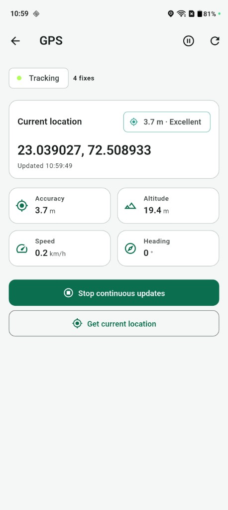

# AI Road Safety Platform

A Flutter-based edge AI and research platform for road-condition monitoring,
flood detection, driver risk assessment, sensor fusion, and dataset lifecycle
management.

The application combines camera frames, TensorFlow Lite inference, GPS, and IMU
signals into a real-time driver HUD. It also provides a local-first research
workspace covering data collection, annotation, quality assessment, experiment
tracking, benchmarking, active learning, and model deployment.

> The project is under active development. It is a research and decision-support
> tool, not a certified automotive safety system.

## Highlights

- Real-time camera preview with throttled raw-frame streaming
- TFLite semantic segmentation for flooded-road detection
- YOLO-ready object detection pipeline with preprocessing and postprocessing
- GPS tracking with speed, heading, altitude, and accuracy
- IMU monitoring with calibration, tilt, orientation, and vibration analysis
- Rule-based risk engine combining flood, speed, GPS, and IMU signals
- Responsive driver HUD with live road status and ranked warnings
- Hive-backed history, image snapshots, filters, export, and analytics
- Dataset collection, metadata synchronization, annotation, and quality gates
- AI model registry, experiment tracking, benchmark evaluation, active learning,
  deployment rollback, and sensor fusion
- Feature-first Clean Architecture with `flutter_bloc`, GetIt, and GoRouter

## Screenshots

<p align="center">
  
  
  
</p>

<p align="center">
  
  
  
</p>

See the [complete screenshot gallery](docs/SCREENSHOTS.md).

## Architecture

The codebase uses feature-first Clean Architecture:

```text
lib/
├── core/                       # DI, routing, theme, errors, shared widgets
└── features/
    ├── camera/
    ├── flood_detection/
    ├── gps/
    ├── imu/
    ├── risk_analysis/
    ├── dashboard/
    ├── history/
    ├── analytics/
    ├── settings/
    └── dataset_collection/     # Dataset and AI lifecycle modules
```

Dependencies point inward:

```text
Presentation → Domain ← Data
```

- Presentation: pages, widgets, and BLoCs
- Domain: entities, repository contracts, services, rules, and use cases
- Data: plugin adapters, TFLite pipelines, local persistence, and repository
  implementations

See [ARCHITECTURE.md](ARCHITECTURE.md) for performance and error-handling
contracts.

## Technology

- Flutter and Dart
- `flutter_bloc` and Equatable
- GetIt dependency injection
- GoRouter navigation
- TensorFlow Lite
- Camera, Geolocator, and Sensors Plus
- Hive and SharedPreferences
- FL Chart
- Dio and Connectivity Plus

## Current roadmap

| Phases | Scope | Status |
|---|---|---|
| 1–5 | Foundation, camera, and AI | Complete |
| 6–10 | Detection, risk, dashboard, history, and analytics | Complete |
| 11–13 | Research platform, dataset tooling, and AI lifecycle | Complete |
| 14–18 | Road intelligence, ADAS, and richer sensor-fusion consumers | Planned |
| 19–22 | Research validation, hardware, and cloud platform | Planned |

## Getting started

### Requirements

- Flutter SDK compatible with Dart `^3.11.4`
- Android Studio or Xcode with a physical device
- Camera and location permissions

Camera, GPS, and IMU behavior should be validated on physical hardware.

### Install and run

```bash
git clone git@github.com:anilthummar/ai_road_safety_platform.git
cd ai_road_safety_platform
flutter pub get
flutter run
```

### AI assets

Model and label assets are configured under:

```text
assets/models/
assets/labels/
```

The flood segmentation model is included. If the configured YOLO model is
absent, object detection intentionally runs in stub mode with no detections.
Add only models whose licenses permit redistribution.

## Quality checks

```bash
dart analyze
flutter test
```

The test suite covers domain engines, repositories, BLoCs, processors, widgets,
and selected golden UI components.

## Data and privacy

- Research data and app preferences are local-first.
- Captured frames and metadata may contain sensitive location information.
- Review generated datasets before sharing or publishing them.
- Cloud synchronization is not part of the current implementation.

## Repository notes

- Do not commit credentials, signing keys, API secrets, or private datasets.
- Keep large experimental artifacts outside Git unless intentionally versioned.
- Generated Flutter build output is excluded through `.gitignore`.
