# Screenshot gallery

Screenshots captured from the Android application during live device testing.

## Driver dashboard

| Sensor warm-up | Live low-risk status | Critical risk |
|---|---|---|
| 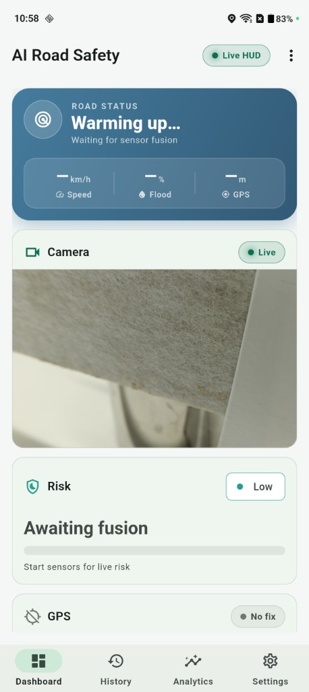 | 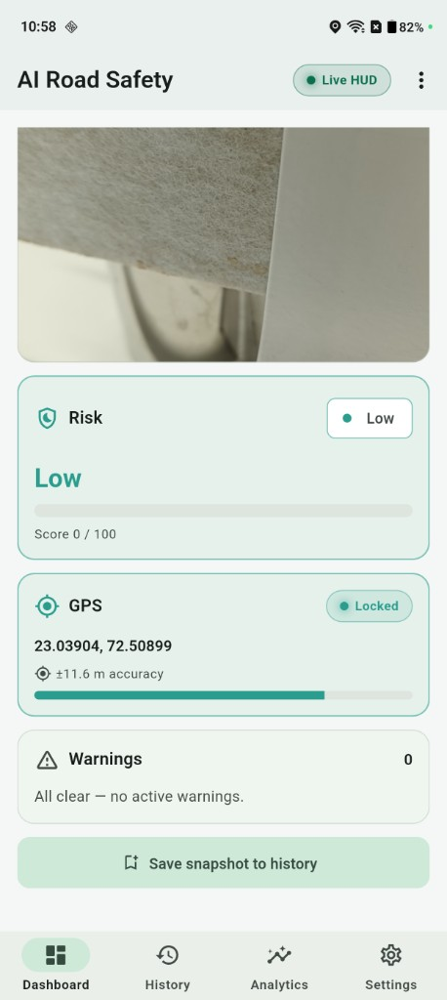 | 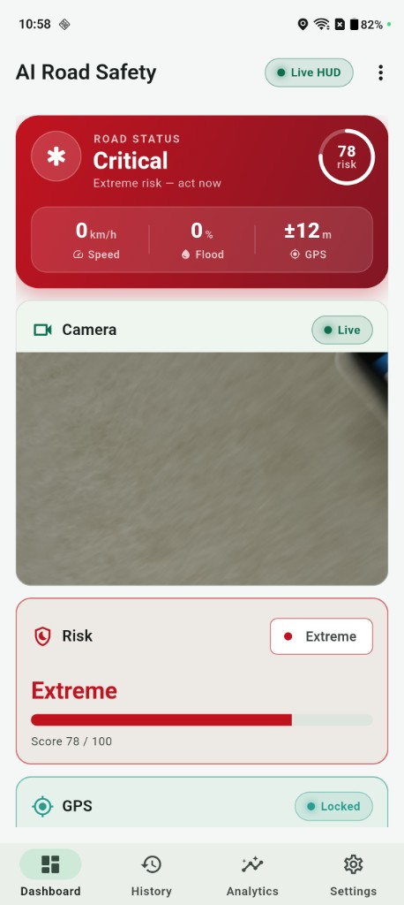 |

## Camera and flood AI

| Camera and AI stream | Flood segmentation |
|---|---|
| 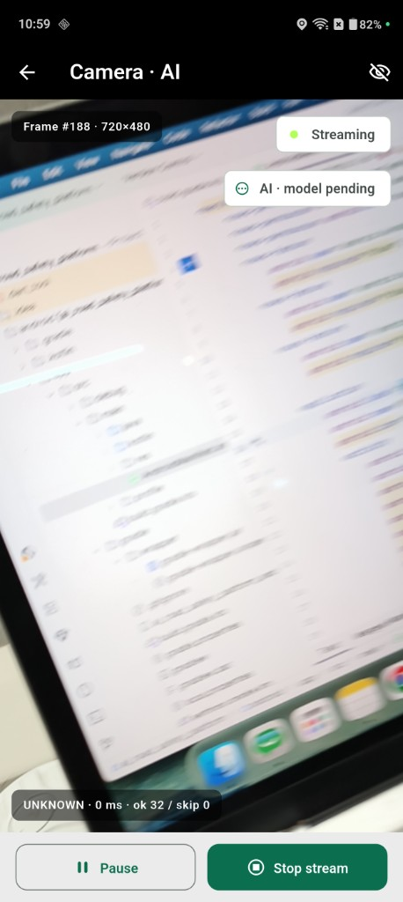 | 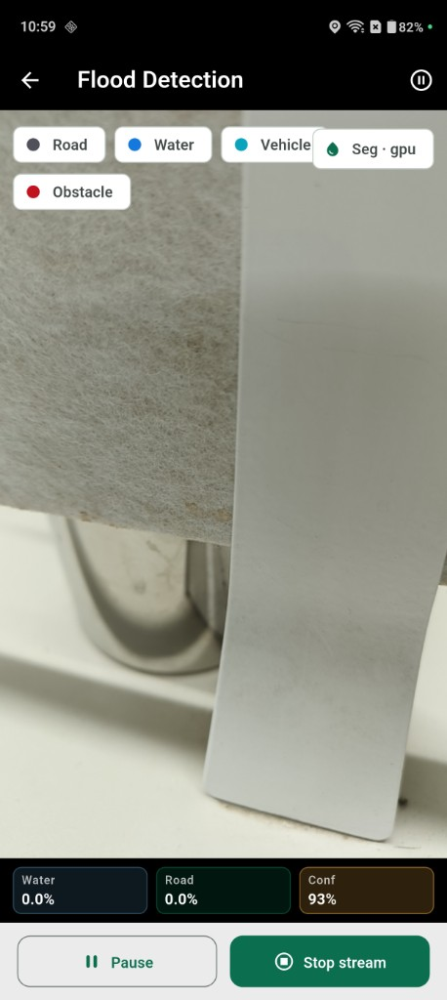 |

## GPS and IMU

| GPS tracking | Calm vibration | Severe vibration |
|---|---|---|
|  | 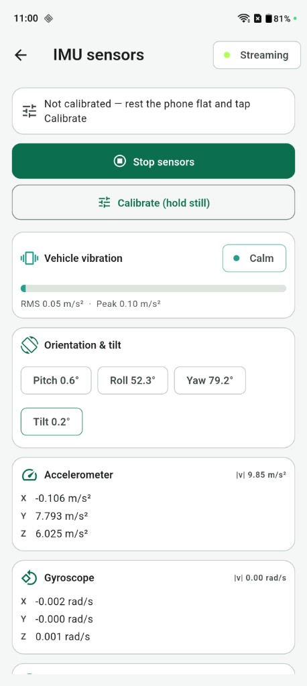 | 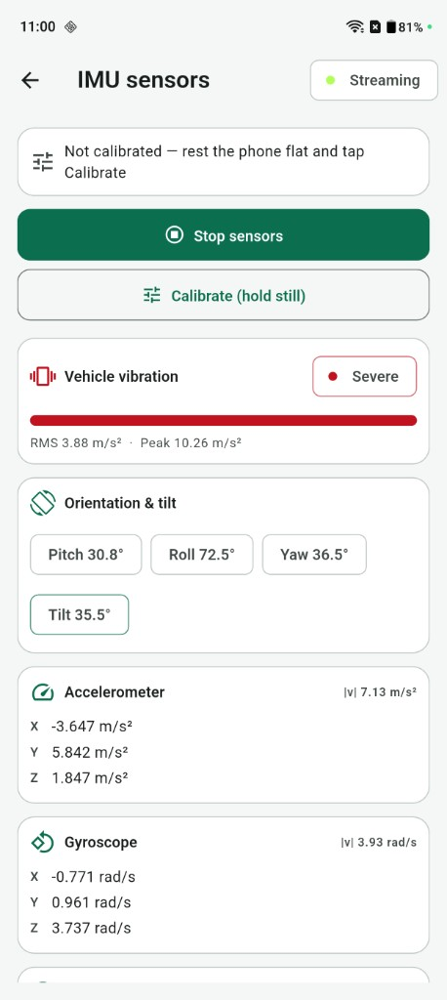 |

## Risk, history, and analytics

| Risk engine | History | Analytics |
|---|---|---|
| 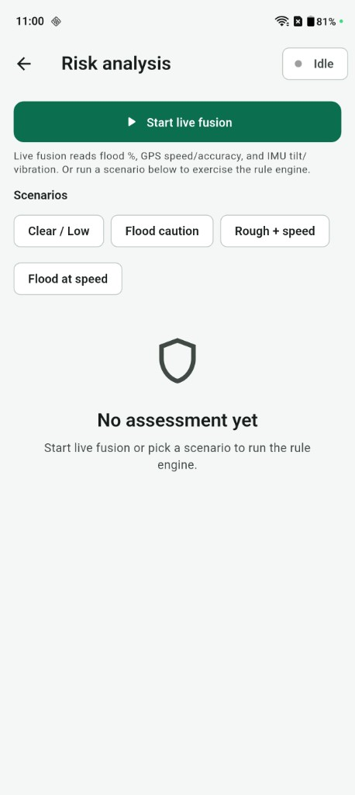 | 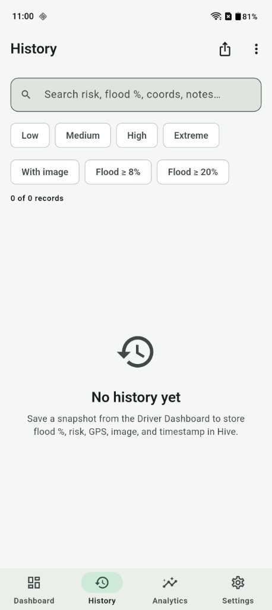 | 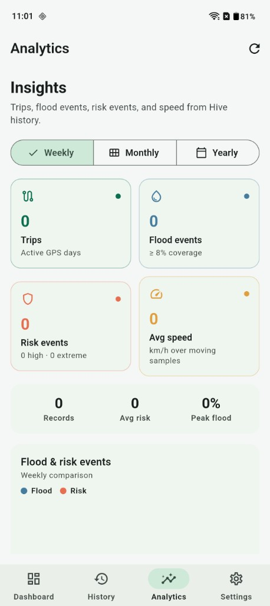 |

## Research platform

| Research workspace | AI lifecycle | Dataset dashboard |
|---|---|---|
| 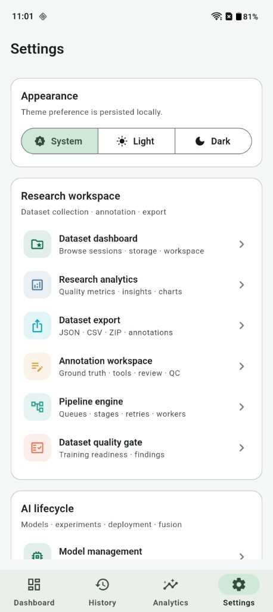 | 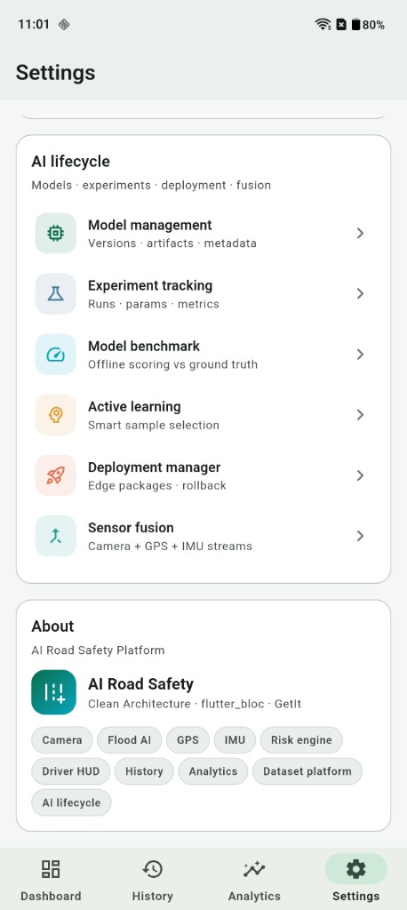 | 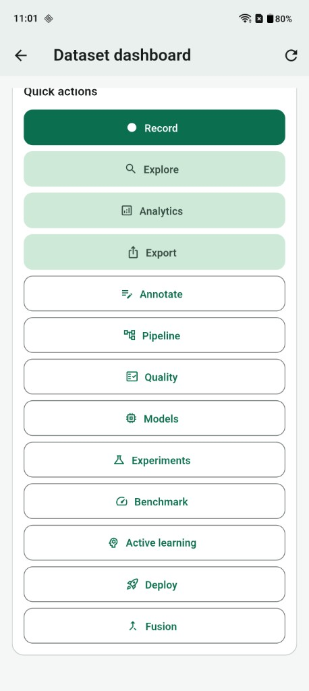 |
